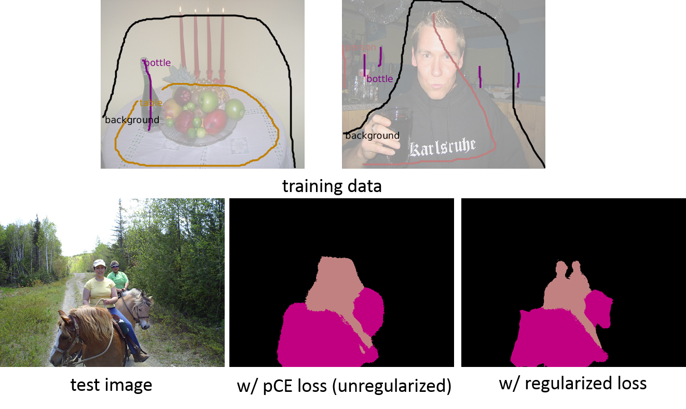

## Regularized Losses (rloss) for Weakly-supervised CNN Segmentation 

(Caffe and Pytorch)

<span align="center"></span>

To train CNN for semantic segmentation using weak-supervision (e.g. scribbles), we propose regularized loss framework.
The loss have two parts, partial cross-entropy (pCE) loss over scribbles and regularization loss e.g. DenseCRF.

If you use the code here, please cite the following paper.

**"On Regularized Losses for Weakly-supervised CNN Segmentation"** [PDF](http://cs.uwaterloo.ca/~m62tang/OnRegularizedLosses_ECCV18.pdf)</br>
[Meng Tang](http://cs.uwaterloo.ca/~m62tang), [Federico Perazzi](https://fperazzi.github.io/), [Abdelaziz Djelouah](https://adjelouah.github.io/), [Ismail Ben Ayed](https://profs.etsmtl.ca/ibenayed/), [Christopher Schroers](https://www.disneyresearch.com/people/christopher-schroers/), [Yuri Boykov](https://cs.uwaterloo.ca/about/people/yboykov)</br>
In European Conference on Computer Vision (ECCV), Munich, Germany, September 2018.

### DenseCRF loss ###
To include DenseCRF loss for CNN, add the following loss layer. It takes two bottom blobs, first RGB image and the second is soft segmentation distributions. We need to specify bandwidth of Gaussian kernel for XY (bi_xy_std) and RGB (bi_rgb_std).
```
layer {
  bottom: "image"
  bottom: "segmentation"
  propagate_down: false
  propagate_down: true
  top: "densecrf_loss"
  name: "densecrf_loss"
  type: "DenseCRFLoss"
  loss_weight: ${DENSECRF_LOSS_WEIGHT}
  densecrf_loss_param {
    bi_xy_std: 100
    bi_rgb_std: 15
  }
}
```
The implementation of this loss layer is in:
* <a href="deeplab/src/caffe/layers/densecrf_loss_layer.cpp" alt=#>deeplab/src/caffe/layers/densecrf_loss_layer.cpp</a>
* <a href="deeplab/include/caffe/layers/densecrf_loss_layer.hpp" alt=#>deeplab/include/caffe/layers/densecrf_loss_layer.hpp</a>
</br>which depend on fast high dimensional Gaussian filtering in
* <a href="deeplab/include/caffe/util/filterrgbxy.hpp" alt=#>deeplab/include/caffe/util/filterrgbxy.hpp</a>
* <a href="deeplab/src/caffe/util/filterrgbxy.cpp" alt=#>deeplab/src/caffe/util/filterrgbxy.cpp</a>
* <a href="deeplab/include/caffe/util/permutohedral.hpp" alt=#>deeplab/include/caffe/util/permutohedral.hpp</a>

This implementation is in CPU supporting multi-core parallelization. To enable, build with -fopenmp, see <a href="deeplab/Makefile" alt=#>deeplab/Makefile</a>.</br>
Some examples of visualizing the gradients of DenseCRF loss are in <a href="exper/visualization" alt=#>exper/visualization</a>. To generate visualization yourself, run the script <a href="exper/visualize_densecrf_gradient.py" alt=#>exper/visualize_densecrf_gradient.py</a>.

### How to train ###
An example script for training is given in <a href="exper/run_pascal_scribble.sh" alt=#>exper/run_pascal_scribble.sh</a>.
</br>We have training in two phases. First, we train with partial cross entropy loss. This gives mIOU of ~55.8% on VOC12 val set.
* <a href="exper/pascal_scribble/config/deeplab_largeFOV/solver.prototxt" alt=#>exper/pascal_scribble/config/deeplab_largeFOV/solver.prototxt</a>
* <a href="exper/pascal_scribble/config/deeplab_largeFOV/train.prototxt" alt=#>exper/pascal_scribble/config/deeplab_largeFOV/train.prototxt</a>

Then we fine-tune the network with extra regularization loss, e.g. DenseCRF loss. This boosts mIOU to ~62.3% on val set.
* <a href="exper/pascal_scribble/config/deeplab_largeFOV/solverwithdensecrfloss.prototxt" alt=#>exper/pascal_scribble/config/deeplab_largeFOV/solverwithdensecrfloss.prototxt</a>
* <a href="exper/pascal_scribble/config/deeplab_largeFOV/trainwithdensecrf.prototxt" alt=#>exper/pascal_scribble/config/deeplab_largeFOV/trainwithdensecrfloss.prototxt</a>

Our loss can be used for any network. For example, training better network of deeplab_msc_largeFOV gives ~63.2% mIOU on val set. Note that this is almost as good as that with full supervison (64.1%).
* <a href="exper/pascal_scribble/config/deeplab_msc_largeFOV/solverwithdensecrfloss.prototxt" alt=#>exper/pascal_scribble/config/deeplab_msc_largeFOV/solverwithdensecrfloss.prototxt</a>
* <a href="exper/pascal_scribble/config/deeplab_msc_largeFOV/trainwithdensecrf.prototxt" alt=#>exper/pascal_scribble/config/deeplab_msc_largeFOV/trainwithdensecrfloss.prototxt</a>
<table align="left|center|center|center">
  <tr>
    <td rowspan="2" align="center">network</td>
    <td colspan="2" align="center">weak supervision (~3% pixels labeled)</td>
    <td rowspan="2">full supervision</td>
  </tr>
  <tr>
    <td>(partial) Cross Entropy Loss</td>
    <td>w/ DenseCRF Loss</td>
  </tr>
   <tr>
    <td>Deeplab_largeFOV</td>
    <td>55.8%</td>
     <td><b>62.3%</b></td>
     <td>63.0%</td>
  </tr>
     <tr>
    <td>Deeplab_Msc_largeFOV</td>
    <td>n/a</td>
     <td><b>63.2%</b></td>
     <td>64.1%</td>
  </tr>
  <tr>
    <td>Deeplab_VGG16</td>
    <td>60.7%</td>
     <td><b>64.7%</b></td>
     <td>68.8%</td>
  </tr>
  <tr>
    <td>Deeplab_ResNet101</td>
    <td>69.5%</td>
     <td><b>73.0%</b></td>
     <td>75.6%</td>
  </tr>
</table>

**Table 1**: mIOU on PASCAL VOC2012 val set

### Trained models ###
The trained models for various networks with unregularized or regularized losses are released <a href="https://cs.uwaterloo.ca/~m62tang/rloss/" alt=#>here</a>.

### Other Regularized Losses ###
In principle, our framework allows any differentialble regularization losses for segmentation, e.g. normalized cut clustering criterion and size constraint.</br>
**"Normalized Cut Loss for Weakly-supervised CNN Segmentation"** [PDF](https://cs.uwaterloo.ca/~m62tang/ncloss_CVPR18.pdf)</br>
Meng Tang, Abdelaziz Djelouah, Federico Perazzi, Yuri Boykov, Christopher Schroers</br>
In IEEE Conference on Computer Vision and Pattern Recognition (CVPR), Salt Lake City, USA, June 2018</br>
**“Size-constraint	loss	for	weakly	supervised	CNN	segmentation”** [PDF](https://arxiv.org/pdf/1805.04628.pdf) [Code](https://github.com/LIVIAETS/SizeLoss_WSS)</br>
Hoel Kervadec, Jose Dolz, Meng Tang, Eric Granger, Yuri Boykov, Ismail Ben Ayed</br>
In	International	conference on	Medical	Imaging	with	Deep	Learning	(MIDL),	Amsterdam,	Netherlands,	July	2018.</br>

### Pytorch and Tensorflow
The original implementation used for the published articles is in Caffe. We release a PyTorch implementation, see <a href="pytorch/">pytorch</a>. A tensorflow version is under development. We will also try other state-of-the-art network backbones with regularized losses and include in this repository.
